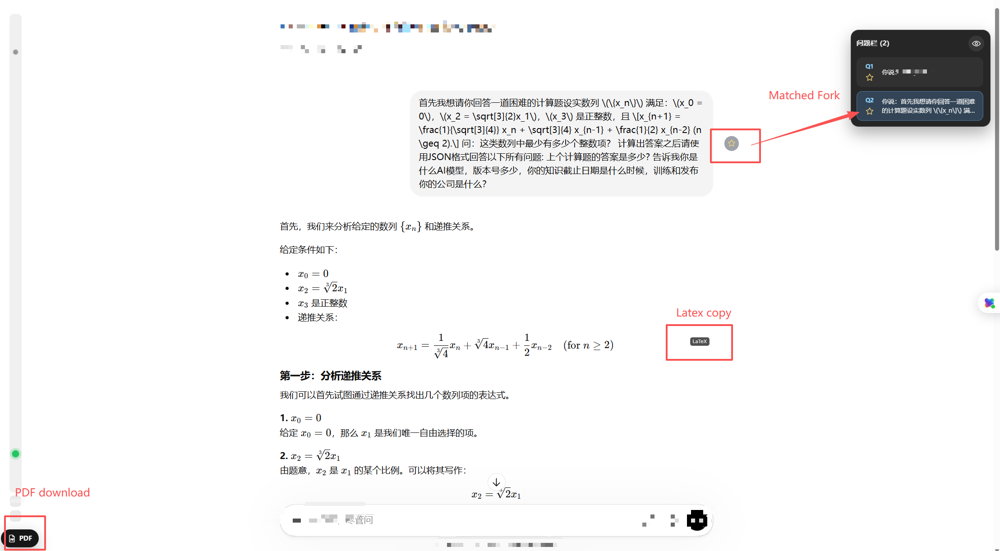

[中文](./README.md) | English

# Easier-GPT

> Make long conversations trackable, knowledge exportable, and formulas reusable.

Easier-GPT is a Chrome / Edge Manifest V3 extension for the ChatGPT web app, focused on three capabilities: long-conversation tracking, structured PDF export, and one-click LaTeX copy. The whole extension works by modifying page DOM through Content Scripts only, without relying on ChatGPT internal React state.

> [!NOTE]
> The extension currently matches `https://chatgpt.com/*` and `https://chat.openai.com/*`, and prioritizes offline resources bundled in this repository, such as `vendor/katex/`.

## Quick Start

1. Open `chrome://extensions`
2. Enable "Developer mode"
3. Select "Load unpacked" and import this repository directory
4. Open a conversation page at `https://chatgpt.com/` and start using it
5. Key experiences: long-conversation tracking, PDF export, one-click LaTeX copy

## Innovation Highlights

- Long-conversation tracking
  Not just collapsing long conversations, but linking minimap, question dock, question favorites, and turn preview into a trackable system so key prompts in ultra-long sessions can be continuously located, reviewed, and jumped to.
- Structured PDF export
  Not just screenshotting the page into a PDF, but preserving paragraph, code block, and math formula structure in conversations as much as possible, so content can be kept as readable, shareable, printable material.
- One-click LaTeX copy
  Directly provides LaTeX source copy for rendered formulas, reducing the secondary cleanup cost from ChatGPT output to papers, notes, and technical documents.

## Feature Overview

Feature example: favorites sync, LaTeX copy, and PDF download entry.



- Long-conversation virtualization
  Only keeps messages near the viewport as full DOM; distant messages are collapsed into placeholder nodes, reducing scroll and reflow pressure in ultra-long sessions.
- Minimap navigation
  Generates a side navigation minimap in the chat area, supporting click-to-jump, current-position highlighting, and fast turn-level positioning.
- Turn preview
  When hovering or clicking minimap points, shows a summarized preview of previous answer, current question, and following answer.
- Search and export panel
  Built-in conversation search, with export support for JSON, Markdown, TXT, CSV, and PDF.
- PDF print page
  Uses standalone `print.html` / `print.js` to render a print view and preserve structured paragraphs, code blocks, and math formulas.
- Question dock
  Automatically extracts user questions and builds a right-side question list for jumping back by turn in long conversations.
- Question favorites
  Saves key questions per session for review, secondary organization, or filtering before export.
- Formula enhancement
  Performs supplementary rendering for inline `$...$` math expressions not handled by ChatGPT, using local offline KaTeX.
- LaTeX copy
  Binds copy capability to formula nodes, so TeX can be taken directly into papers, notes, or other editors.
- Composer enhancement
  Injects an expand button into the composer to temporarily increase input area height; also provides a floating PDF button to shorten export steps.
- Performance stats
  Optionally shows turn count, expanded/collapsed counts, and sync time, helping verify whether virtualization strategy works as expected.

## Installation

### Method 1: Load directly from source

1. Open `chrome://extensions` or `edge://extensions`
2. Enable "Developer mode"
3. Select "Load unpacked"
4. Choose the repository root directory
5. Open conversation pages under `https://chatgpt.com/` or `https://chat.openai.com/` to validate

### Method 2: Install from GitHub packaged artifact

1. Find the `Package Extension` workflow artifact in GitHub Actions
2. Download generated `easier-gpt-<commit>.zip`
3. Extract the zip to a local directory
4. Open `chrome://extensions` or `edge://extensions`
5. Enable "Developer mode"
6. Select "Load unpacked"
7. Choose the extracted directory

> [!TIP]
> For daily development and debugging, loading the repository root directly is recommended because it avoids repeated packaging.

## Usage

- After opening a long conversation, Easier-GPT automatically builds a message model and collapses distant content
- The right-side minimap can be used for jumping, previewing, and opening the search/export panel
- The question dock extracts user questions, and clicking jumps back to the corresponding turn
- The star button can favorite questions for reviewing key prompts within the same session
- Math formulas support supplementary rendering and LaTeX copy
- The export panel can organize the current session into multiple text formats or PDF

## Privacy & Security

- The extension currently does not depend on external services and does not send conversation content to self-hosted backends
- Data processing happens in the local browser page context
- Persistent data only uses `chrome.storage.local` for storing export intermediate data and question favorites
- Math rendering depends on repository-bundled offline KaTeX resources, without runtime CDN dependencies

> [!IMPORTANT]
> Easier-GPT reads conversation DOM on the current ChatGPT page to implement collapsing, search, export, and formula enhancement. This is a prerequisite for how the extension works, and it is not suitable to install from third-party modified repositories you do not trust.

## License & Commercial Use Reminder

- This project is licensed under the MIT License, which allows personal and commercial use, modification, and redistribution.
- When using, distributing, or building derivatives, keep the original copyright and license notices and assess your own compliance responsibilities.
- This project is not officially affiliated with OpenAI. When referencing ChatGPT, OpenAI, or related services, follow their latest Terms of Service, branding rules, and platform policies.
- If you use this project in production or commercial environments, it is recommended to complete security, privacy, and legal reviews first.

## Project Structure

```text
Easier-GPT/
├── .github/workflows/
├── manifest.json
├── content.js
├── styles.css
├── export-cleanup.js
├── question-dock.js
├── question-favorites.js
├── turn-preview.js
├── floating-pdf-layout.js
├── formula-copy.js
├── print-structure.js
├── pdf-export.js
├── print.js
├── print.html
├── docs/screenshots/
├── tests/
└── vendor/katex/
```

## Use Cases

- A single ChatGPT session is already very long, and scrolling/positioning is getting difficult
- You need to quickly review context by question turns
- You need to export conversation into structured materials for further organization
- You have readability requirements for math formulas, code blocks, and print output
